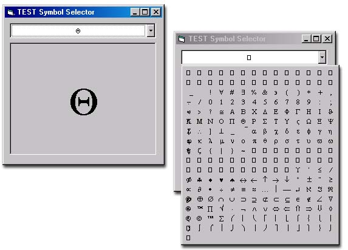



## Symbol Selector ActiveX

### Description

Symbol Selector OCX is a dropdown combobox to let user select a symbol from the popup window, just like selecting a color in MS Office Apps. It has been revised from another submission on PSC which was "Color Picker" By Abdul Gafoor.GK.
 
### More Info
 

             |
---                |---
**Submitted On**   |2002-06-06 09:09:34
**By**             |[Tezcan CIRAKOGLU](https://github.com/Planet-Source-Code/PSCIndex/blob/master/ByAuthor/tezcan-cirakoglu.md)
**Level**          |Advanced
**User Rating**    |5.0 (10 globes from 2 users)
**Compatibility**  |VB 4\.0 \(32\-bit\), VB 5\.0, VB 6\.0
**Category**       |[OLE/ COM/ DCOM/ Active\-X](https://github.com/Planet-Source-Code/PSCIndex/blob/master/ByCategory/ole-com-dcom-active-x__1-29.md)
**World**          |[Visual Basic](https://github.com/Planet-Source-Code/PSCIndex/blob/master/ByWorld/visual-basic.md)
**Archive File**   |[Symbol\_Sel90807662002\.zip](https://github.com/Planet-Source-Code/tezcan-cirakoglu-symbol-selector-activex__1-35521/archive/master.zip)

